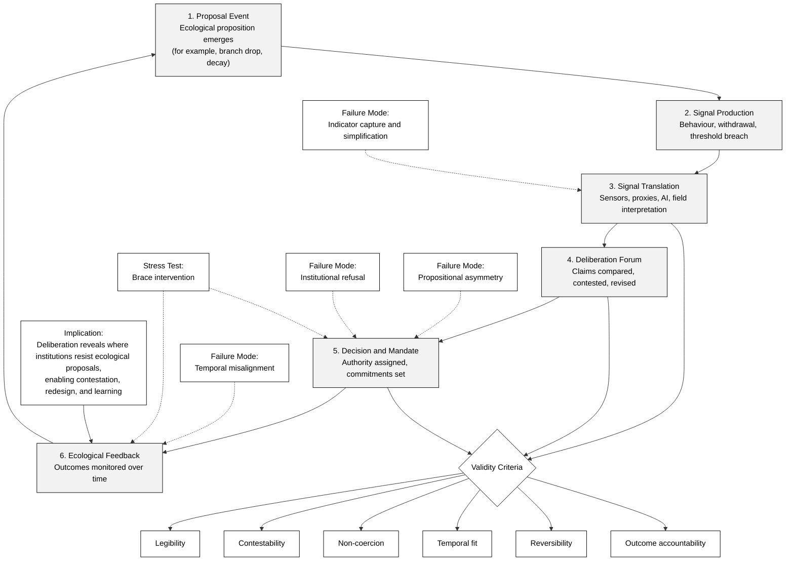

The concept of more-than-human deliberation is a key aspect of the more-than-human approach to design. It emphasises the importance of considering the perspectives and needs of non-human entities, such as animals, plants, and ecosystems, in the design process.

In practical terms, more-than-human deliberation must support exchange across parties with different perceptual, cognitive, temporal, and communicative capacities. Designers therefore need mechanisms that can sense ecological response, translate signals without collapsing difference, and route those signals into accountable collective decisions.

See also [[concept.participation]], [[concept.meaning.translation]], [[concept.voice]], [[concept.knowledge.sensing]], and [[research.methods.more-than-human-design]].

## Re-Organisation Considerations for a Narrative Describing the Concept of More-Than-Human Deliberation

For the narrative, this note can be read as an operational pipeline rather than only a list of methods:

1. Proposal event: a design intervention enters a shared ecology.
2. Signal production: human and nonhuman actors respond through behaviour, condition, or refusal.
3. Signal translation: responses become interpretable across species and institutions.
4. Deliberation forum: claims are compared, challenged, and revised.
5. Decision and mandate: a bounded action is selected with explicit responsibility.
6. Ecological feedback: outcomes are tracked and can reopen earlier decisions.

In the branch-as-proposal frame, a dropped branch can function as a design proposition. Communities then register positions through uptake, avoidance, repurposing, obstruction, nesting, decay trajectories, fungal colonisation, and other relational traces. These traces can be treated as deliberative signals when institutions define how to read, contest, and act on them.[^3][^19][^20]

## Framing: Necessary Operations for More-Than-Human Deliberation

This resource note catalogues mechanisms for six operations that any more-than-human deliberative setting must perform:

- Detect signals: identify ecologically meaningful responses.
- Interpret signals: generate competing, auditable readings.
- Represent interests: assign standing and speaking roles.
- Negotiate differences: compare claims under conflict, not only consensus.
- Decide with mandate: link outcomes to explicit authority and duty.
- Reassess over time: reopen decisions as ecological conditions shift.

### What Counts as an Equivalent of Opinion

In this context, an "opinion" does not need linguistic form. It can appear as:

- Preference: repeated approach, use, or selection among alternatives.
- Refusal or withdrawal: avoidance, exit, stress behaviour, non-participation, or habitat departure.[^9]
- Threshold breach: measurable deterioration that signals intolerable conditions.[^10][^11]
- Sustained thriving: stable or improving indicators over relevant temporal scales.[^12][^13]
- Relational reconfiguration: changed multispecies associations, including new dependencies or exclusions.[^18][^19]

### Deliberative Validity Criteria

Mechanisms below can be compared against six validity criteria:

- Legibility: signals are sufficiently interpretable for collective use.
- Contestability: readings can be challenged with evidence and method.
- Reversibility: decisions can be revised when harms or errors appear.
- Non-coercion: participants can withdraw and refusal has consequence.[^9]
- Temporal fit: evaluation windows match species and ecosystem timescales.[^3]
- Outcome accountability: ecological effects are tracked after decisions.[^10][^12]

### Handling Disagreement Between Evidence Channels

When proxy accounts, AI interpretations, and field observations diverge, forums can use a structured dispute protocol:

1. Register divergence explicitly rather than forcing a single synthesis.
2. Trace each claim to source, method, uncertainty, and mandate.
3. Run additional observation or trial rounds where stakes permit.
4. Apply precautionary thresholds when uncertainty is high and harms are asymmetric.
5. Publish rationale for the chosen action and review trigger conditions.

### Ventriloquism Risk and Audit Requirements

Proxy and translation mechanisms can amplify nonhuman concerns or overwrite them. To reduce ventriloquism risk, protocols should require explicit mandate statements, uncertainty disclosure, counter-interpretation opportunities, and periodic external review of interpretation quality.[^14][^16][^17]

Mechanisms through which more-than-human communities (including animals, plants, ecosystems, collectives, technologies, and places) can assess design proposals, give feedback, deliberate, trial interventions, negotiate compromises, and guide future directions include:

## 1 Embodied and Experiential Co‑Design Mechanisms

### Sensory and Embodied Mediation

Embodied suits enabling designers to perceive environments through simulated nonhuman sensory constraints.[^1] Cf. also mimicking animal experiencing.[^2]

These suits generate contracts between species and inform iterative, reciprocal design trials. They can:

- Introduce correspondence between human and animal perceptual worlds.
- Allow physical interaction with landscape conditions as a form of feedback.
- Support procedural mechanisms or action–reaction protocols through which nonhuman behaviour shapes design.

### In-Situ Immersive Deliberation

Place-based presence allows design and governance decisions in barns, riverscapes, and forests, where humans can directly observe ecological signals from other beings.[^3]

Mechanisms include:

- Real-time embodied evaluation of design impacts.
- Situating decisions within the lived ecologies of participating species.
- Interpreting environmental responses as deliberative input.

## 2 More‑Than‑Human Assemblies and Role‑Play Mechanisms

### Multispecies Municipal Assemblies

Multistage assemblies in which participants embody nonhuman actors (soil, forest, wild fauna) use role-play to surface ecological needs, conflicts, and alliances.[^4]

This mechanism enables:

- Role‑based articulation of ecological needs and constraints.
- Conflict emergence, not only consensus, as a legitimate deliberative mode.
- Temporalities and lifeworlds of nonhumans entering deliberation (e.g., forest’s timescales).
- Assessment through speculative interventions (e.g., forest threatening to stop photosynthesis).

Outcomes expose:

- How ecosystems express “political” agency through behavioural or ecological signals.
- How compromise is negotiated when actor groups have diverging interests.

### Experimental Parliaments of Nonhuman Beings

Experiments that function as staged deliberative arenas, translating ecological data and embodied movement into policy‑relevant narratives.[^5]

These parliaments introduce imaginative, performative, and affective routes to design evaluation and multispecies consensus‑making. These practices:

- Set humans to “ask” other species questions and speculate through guided empathy.
- Use hybrid media (sound maps, walking practices, films) to represent nonhuman interests.
- Promote multisensory and multispecies deliberation beyond linguistic communication.
- Aim to incorporate multiscale, multisensory data into “policy proposals”.

Examples and precedents:

- [_Council of All Beings_](https://workthatreconnects.org/resources/council-of-all-beings/) (workshop practice developed by Joanna Macy and colleagues): humans speak or act as proxies for other species to surface needs and ethical responsibilities.
- Latour's [_Parliament of Things_](https://www.embassyofthenorthsea.com/welkom-in-het-parlement-van-de-dingen/) and related cosmopolitical experiments that reframe nonhuman entities as political actors (see Bruno Latour, Isabelle Stengers).
- [_Embassy of the North Sea_](https://www.embassyofthenorthsea.com/) (art and activist enactments that give marine ecologies an institutional voice) as an example of cultural-institutional representation.
- Experiments such as the [_Parliament of Species_](https://parliamentofspecies.org/) and the [_Parliament of the Loire_](https://www.leparlementdeloire.org/) that stage hybrid media and embodied practices to translate ecological data into deliberative narratives.

Practical facilitation patterns:

- Designated spokes-beings: assign participants to represent specific taxa, processes, or places, using constraints and briefings drawn from ecological data.
- Sensory translation: use sonification, smell maps, and material proxies to communicate nonlinguistic signals to deliberants.
- Contingent consent protocols: allow represented "actors" to withdraw or change stance through pre-defined behaviour-based signals.
- Iterated scenario workshops: run short time-boxed negotiation rounds, then enact ecological feedback (e.g., simulated drought, noise events) to see how positions shift.

These examples show how enactment, mediation, and material translation can make nonhuman interests legible in human civic forums. They also indicate common trade-offs: theatricality can open imagination but risks oversimplifying ecological complexity; proxy representation can surface needs but requires careful ethical facilitation.

## 3 Representational and Mediated Feedback Mechanisms

### Proxy Representation/Delegation

Deliberative practices may assign human delegates to represent specific nonhuman entities (rivers, species, forests), using ecological science, Indigenous knowledge, behavioural insights, or AI‑supported communication.

Human delegates can represent nonhuman communities by:

- Mandating proxy delegates to voice ecological interests explicitly.
- Interpreting ecological data as communicative signals.
- Translating multispecies interests into deliberative processes.
- Embedding ecological reflexivity into institutional responses.

Institutional examples clarify how proxy delegation works in practice:

- Whanganui River (Aotearoa New Zealand): Te Awa Tupua grants legal personhood to the river, while Te Pou Tupua (two human guardians, appointed by the Crown and Whanganui Iwi) speaks and acts for the river as one representative voice.[^6]
- Victorian Environmental Water Holder (Australia): a statutory body holds and manages environmental water entitlements, using ecological indicators and seasonal conditions to decide when and where water should support river and wetland health.[^6]
- Indigenous legal-plural governance settings: legal personality models can function as a proxy mechanism that carries Indigenous relational obligations into formal institutions, rather than treating ecosystems as passive objects of management.[^7]

Academic analyses describe this as delegated ecological standing: institutions assign legally recognised human actors to represent ecological entities that cannot appear directly in legal or policy forums.[^6][^8] In deliberative design terms, proxy delegates work best when mandates are explicit, accountability is transparent, and ecological indicators trigger review obligations rather than optional consultation.[^3][^6]

### Mediated and Contingent Consent (Animal–Computer Interaction)

In more-than-human participatory work (for example, with dogs, bees, or trees), design trials can rely on contingent consent. This approach assumes that participants can withdraw or show behavioural indicators of distress or preference, which can then be interpreted through repeated choice protocols and situated expertise. The resulting evidence can support non-coercive evaluation.[^9]

Mechanisms for evaluating design interventions with animals:

- Contingent consent through freedom to withdraw or choose between options.
- Dichotomous or multi‑stimulus choice protocols to detect preferences.
- Carer‑mediated consent combining contextual knowledge and welfare expertise.
- Behavioural cues used as acceptance/rejection indicators for trials of design prototypes.

## 4 Ecological Indicators and Data‑Driven Assessment Mechanisms as Deliberative Signals

More‑than‑human deliberation requires recognising ecosystems as communicative actors whose conditions and responses provide essential political feedback. Humans can treat ecological signals such as rivers failing to flow, species extinctions, or forests dying as inputs into democratic deliberation, not merely background conditions.[^3]

This approach aligns with work in global science–policy assessments. The Millennium Ecosystem Assessment establishes that ecosystem health can be tracked through status and trend indicators, such as biodiversity decline, changes in ecosystem services, and evidence of critical thresholds being crossed.

Literature on planetary wellbeing emphasises population‑level trends as evidence of unmet ecological needs.[^10]

Inadequate or misleading ecological indicators obscure the true state of life‑support systems, while more comprehensive measures can reveal the state of economic, social and ecological systems.[^11]

In urban and regional contexts, indicators such as ecological footprints, resource flows, and landscape health metrics can act as tools for assessing whether urban communities are reducing pressures on bioregions and maintaining ecological integrity.[^12]

Cf. “Earth’s vital signs” and other pattern languages. Environmental performance metrics (for example, pollution indicators and sustainability indexes) can, when systematically integrated, hold decision-makers accountable by acting as communication media that clarify how human political and economic choices manifest as ecological consequences.[^13]

## 5 AI‑Enabled Multispecies Communication Mechanisms

AI-enabled multispecies communication can operate as an evidentiary interface rather than a proxy speaker. It can align acoustic, behavioural, environmental, and situated records, surface uncertainty, and produce competing interpretations that deliberants can test against field knowledge and local expertise.[^14][^15]

This framing keeps judgement with the deliberative forum while making disagreement explicit through confidence ranges, error patterns, and model divergence. It can reduce ventriloquism and overclaiming in claims about nonhuman interests when protocols require contestability and uncertainty reporting.[^16]

Within this frame, the United Nations Development Programme’s [Introducing Blue Marble](https://www.undp.org/stories/introducing-blue-marble) and its working prototype, [Blue Marble](https://bm.tandemic.com/), together with [Emissary of GAIA](https://emissaryofgaia.com/wp-content/uploads/2023/11/Whitepaper-Emissary-of-GAIA-Milan-Meyberg.pdf), can be read as speculative deliberation infrastructures that assemble heterogeneous evidence for contestable multispecies claims.[^17]

Some argue that AI can also interpret nonhuman communication (animal vocalisations, ecosystem health signals), providing data‑driven “voices” for deliberation.

Research directions:

- Protocol design: compare "AI as early-warning" versus "AI as proxy voice" in deliberative outcomes.
- Uncertainty interfaces: test how confidence intervals and model disagreement affect multispecies decisions.
- Contestability tools: build mechanisms for stakeholders to challenge model assumptions and retrain priorities.
- Longitudinal evaluation: track whether AI-mediated deliberation improves ecological outcomes over seasons/years.
- Ethics-by-design: embed withdrawal/contingent consent logic from ACI into sensing and intervention workflows.

## 6 Participatory and Ethnographic Co‑Research Mechanisms

More-than-human co-research treats inquiry as a shared practice among researchers, communities, and situated nonhuman participants. Instead of extracting data and translating it later, this approach builds interpretation during field engagement through repeated observation, co-presence, and iterative checking of claims against ecological response.[^5][^17][^18]

Core mechanisms include:

- Co-defined research questions with local practitioners, custodians, and field experts, so that inquiry tracks real ecological and social decisions.
- Multimodal field protocols that combine sensory ethnography, behavioural observation, and ecological recording in one time-linked log.
- Co-interpretation sessions where participants compare field notes, indicators, and model outputs, then revise explanations before proposing interventions.
- Translation loops from observation to representation to action, with explicit checks for over-interpretation, anthropocentric projection, and missing evidence.
- Publicly traceable outputs such as annotated maps, species diaries, and protocol notes that document how claims were produced and contested.

Multispecies ethnography literature frames this work as an "art of attentiveness": careful noticing, situated interpretation, and accountable response across unequal relations of power and knowledge.[^19][^20][^21] In practice, this means that methods must specify who observes, who interprets, who can challenge a claim, and how new ecological signals reopen earlier conclusions.

## 7 Multispecies Governance Frameworks

Governance mechanisms determine how deliberative signals become durable decisions with clear accountability. Two linked frameworks are central here.

### Ladder of Multispecies Participation

The ladder model maps participation from weak inclusion to commoning-oriented governance.[^22][^23] As an operational device, it helps actors specify:

- Who defines the problem and the acceptable evidence.
- Who can represent whom, under what mandate.
- Whether nonhuman interests can alter outcomes or only inform them.
- How disagreement and refusal affect final decisions.

Used this way, the ladder is not only diagnostic. It can guide design of institutional upgrades, for example moving from consultative proxy inclusion to co-governance with binding ecological thresholds and review duties.

### Reflexive Institutions

Reflexive institutions treat decisions as revisable commitments rather than one-off settlements.[^3] They can operationalise multispecies deliberation through:

- Triggered review rules linked to ecological indicators and threshold events.
- Public decision logs that record evidence channels, uncertainty, and reasons.
- Mandate clarity for delegates, guardians, and expert translators.
- Independent challenge paths for contested interpretations.
- Iterative trial cycles that connect intervention, monitoring, and redesign.

### Minimal Governance Schema for Resource Use

Across legal, civic, and design settings, a minimal schema can support consistent practice:

1. Standing: define which entities and collectives count in the forum.
2. Voice: define how each entity can register preference, refusal, or harm.
3. Mandate: define who can act on behalf of whom, with constraints.
4. Decision rule: define how conflicts are resolved under uncertainty.
5. Review: define when outcomes are reopened and by whom.

This schema connects the mechanisms in Sections 1 to 6 to institutional follow-through, so that signals from more-than-human communities become actionable and auditable parts of governance.

## Limits, Theoretical Integration, and Failure Modes

### Narrative Improvements to Carry Forward

- The argument can appear too homogeneous where related theories remain unsettled.
- Engagement with democratic deliberation theory can be deepened.
- The relationship between science and political theory can be made more explicit.
- Counterexamples and critiques of the mechanisms should be included (but see below).
- The need for multiplicitous approaches that coexist should be emphasised.

### The Six-Stage Pipeline Mapped to Deliberative Democracy Theory

The six-stage pipeline articulated for more-than-human deliberation can be read as an extension and reconfiguration of deliberative democracy rather than a departure from it.

1. Proposal event aligns with agenda formation in deliberative systems. Classical deliberative theory assumes that issues enter deliberation through human articulation. Here, agenda-setting shifts toward ecological processes that surface matters of concern before human framing, which resonates with systemic accounts that distribute deliberation across sites and moments rather than one forum.[^26]
2. Signal production corresponds to preference expression, but in a non-linguistic register. Behavioural change, withdrawal, or threshold breach operate as forms of political expression analogous to protest, exit, or silence in human deliberation, challenging speech-centric models while remaining compatible with pluralist accounts of democratic communication.[^24]
3. Signal translation occupies the role of mediation and interpretation traditionally performed by representatives, experts, or facilitators. This stage makes explicit what deliberative theory often treats implicitly: all participation is mediated, and translation must remain contestable to avoid domination.[^27]
4. Deliberation forum maps to spaces of claim comparison and contestation. Unlike consensus-oriented models, this framing aligns with agonistic and pluralist theories that treat disagreement, incommensurability, and provisional settlement as legitimate outcomes rather than failures.[^28]
5. Decision and mandate corresponds to coupling deliberation with authority. The emphasis on explicit mandate reflects critiques of participatory processes that generate insight without responsibility, reinforcing the need for binding commitments rather than consultative inclusion.[^3]
6. Ecological feedback operationalises deliberative learning. Outcomes are not final judgements but inputs into subsequent cycles, aligning with reflexive and systemic models that evaluate democracy by its capacity to revise decisions in light of consequences rather than by consensus alone.[^26]

### Limits and Failure Modes (DDL Nonhuman Personas Case)

More-than-human deliberation expands the scope of who and what can shape collective decisions, but it introduces characteristic limits that should be named explicitly to avoid overclaiming.

First, propositional asymmetry persists. Nonhuman beings generate proposals through ecological processes such as decay, colonisation, or withdrawal of control, but they do not control how those proposals are interpreted, prioritised, or enacted. Even when deliberative protocols reduce ventriloquism, final authority remains with human institutions, which can systematically favour proposals that align with existing risk regimes, aesthetics, or time horizons. This creates a structural bias toward partial uptake rather than full redirection, especially under uncertainty or political pressure.[^3]

Second, indicator capture and simplification remains a persistent risk. Translating ecological response into indicators improves legibility and contestability, but it also privileges what can be sensed, measured, or modelled. Capabilities that depend on rare events, long temporal arcs, or diffuse relationships may be undervalued, leading deliberation to converge on proposals that perform well against indicators while undermining slower or less legible forms of thriving.[^24]

Third, institutional refusal represents a hard failure mode. Deliberative systems can register refusal by nonhuman participants, but they cannot guarantee that human institutions will accept the consequences of that refusal. Where legal, economic, or safety frameworks treat nonhuman harm as secondary, deliberation risks becoming advisory rather than binding, reproducing tokenistic participation under a more inclusive vocabulary.[^25]

Finally, temporal misalignment remains unresolved. Even reflexive institutions struggle to sustain commitment across ecological timescales that exceed electoral cycles, funding horizons, or infrastructure lifespans. Without explicit mechanisms for long-term mandate transfer and review, early deliberative gains can erode as responsibility shifts across administrations.[^26]

### Stress Test: The Brace Intervention as a Deliberative Failure Case

The Brace intervention in the Melbourne urban forest case provides a concrete counterexample that tests the robustness of more-than-human deliberation.

Brace emerges as a partial human response to the Tree persona’s Decay proposal. By mechanically supporting ageing trees, communities accept the refusal to remove them while simultaneously constraining collapse, ground disturbance, and nutrient cycling. From a deliberative perspective, this represents selective uptake: the proposal is acknowledged but domesticated to fit human risk tolerances and maintenance regimes.

Empirically, the model shows that Brace stabilises canopy presence but limits benefits for ground-dwelling species such as lizards, whose reproductive and foraging capabilities depend on fallen logs, soil disturbance, and debris accumulation. As a result, indicators for Communicate and Reproduce remain suppressed relative to scenarios where full Decay is supported.

From a deliberative standpoint, this reveals a failure mode of proportionality. Human institutions respond to nonhuman proposals in ways that minimise perceived risk while neutralising transformative potential. The Tree persona’s proposal generates directional pressure, yet institutional filtering redirects that pressure into incremental adjustment rather than pathway redirection.

This case shows why deliberative validity cannot be assessed only at the point of inclusion or representation. Even when nonhuman proposals enter deliberation and shape decisions, downstream implementation can reassert anthropocentric priorities.

#### Further Workflow Design Challenges for Deliberative Systems

The same stress test also exposes meaning loss during indicator capture and simplification. The model treats retained perch branches under reduced canopy pruning as suitable for Bird persona communal roosting, yet roost suitability depends on many other conditions, including noise, heat, predator pressure, and species-specific behaviour. A branch counted as suitable in one location may be not equivalent to a branch retained under different ecological conditions, such as above a larger habitat island. If workflows treat these as like-for-like units, deliberation can overstate success while masking differences that matter to nonhuman proposers and users.

This vulnerability is not unique to the Brace intervention. A parallel case appears in building-envelope retrofit. Some rooftops can support grasslands, shrubs, heavy translocated branches that can provide places for reproduction or habitat for insects lizard can forage. Other rooftops are too weak or steep, but can be  traversable for mate-searching. If assessment collapses these roof types into one  category, the workflow misguides downstream decisions.

More-than-human deliberation therefore requires workflow design that preserves ecological, relational, political meanings across translation stages. Potential approaches might involve context-sensitive indicator schemas, comparators that prevent false equivalence, uncertainty tags on proxy measures, and mandatory review triggers when outcomes diverge across species or site conditions.

### Implication

Taken together, these analyses suggest that more-than-human deliberation is not undermined by its limits but defined by them. Its value lies less in guaranteeing just outcomes and more in making visible where, how, and why institutions resist ecological proposals, thus creating grounds for contestation, redesign, and institutional learning.

## Conceptual Schema: Proposals, Communities, Delegation, and Personas in the Nonhuman-Led Futures Method

### A. Fuzzy Beings and Variable Roles

In this framework, beings are not fixed or neatly bounded individuals.

They can be:

- Proteins signalling.
- Cells differentiating.
- Microorganisms co‑metabolising.
- Organisms acting.
- Collectives (populations, species, guilds).
- Consortia (soil communities, microbiomes).
- Infrastructures (utility poles, roadbeds).
- Hybrid assemblages (trees plus fungi, humans plus gut flora).

Each has interests, capacities, and stakes that vary with context.

Thus, “community” cannot rely on stable individuals.

Instead, communities are situational constellations of beings and processes whose interests intersect.

A fungus feeding on a nurse log, a bird establishing roosting patterns, a tree adjusting growth under stress, a human drawing a plan or compacting soil, all can express a directed or undirected possibility.

Any being (or process) can in principle take on different roles, such as:

- Proposers: entities that generate possibilities through capability expression.
- Beneficiaries: entities whose interests change when events (such as those proposed) unfold.
- Trial makers: entities that probe, test or partially enact proposals (a fungus growing into a stump is a trial; a human installing a bark sleeve is a trial).
- Assessors: Entities that modulate or filter proposals through persistence, rejection, compatibility, uptake, mortality, regrowth, conflict or cooperation.

Their roles emerge from context, not from species identity.

These roles shift fluidly.

- A bird may _propose_ canopy structures through roosting patterns,
- _trial_ hollow occupancy,
- and _assess_ the viability of structures by staying or leaving.

Humans do the same.

All beings oscillate among roles; no role is fixed, no role belongs to a species.

### B. What Counts as a Proposal?

A proposal is any expression of directed possibility. It may be symbolic, material, behavioural, structural or latent.

#### Human Proposals

Humans propose through:

- Texts, drawings, models, plans, risk calculations, planning rules, pruning instructions.
- Bodily and actions (walking desire lines, compacting soil, planting species).
- Cultural/habitual patters habitual patterns (waste disposal, shade preference, aesthetic choices, consumption, neglect).
- Institutional codes and cultural norms.

Humans propose symbolically, bodily, and materially because humans are animals embedded in microbial and material collectives. They also propose through infrastructure, labour, and neglect.

#### Nonhuman Proposals (Our Key Innovation)

Nonhumans propose through:

- Capability expression (valencies for decay, regeneration, colonisation, recruitment, structural re‑use).
- Material action (dropping, growing, roosting, tunnelling, dispersing).
- Latent possibility (a limb that would fall, a colony that would spread if not suppressed).
- Trials (partial uptake, tentative exploration, episodic behaviour).

A tree’s potential to drop a branch remains a proposal even when pruning suppresses its enactment.

The capability itself carries directionality.

Examples:

- A tree _drops a branch_: an enacted proposal.
- A tree _would_ drop a branch if humans did not intervene: a latent proposal.
- A lizard _attempts_ to traverse a surface: a trial proposal.
- Fungi _digest_ a fallen log: a follow‑through proposal.
- A bird’s roosting pattern _suggests_ canopy configurations: a behavioural proposal.

#### Nonliving Proposals

Nonliving dynamics produce undirected options, such as:

- Erosion.
- Hydrological pooling.
- Temperature gradients.
- Gravitational loads.

These do not intend, but they shape the option field that others take up.

#### Working Definition

Proposals are expressions of directed or emergent possibility expressed through capability, action, or potential. They include symbolic, material, behavioural and latent forms produced by human, nonhuman and nonliving beings.

### C. Personas in This Schema

A persona is a focusing device that gathers the distributed tendencies, capabilities, stakes and valencies of a heterogeneous group into a coherent interpretive perspective.

A persona:

- Represents group-level interests, not individuals.
- Enables plural, multi-perspective interpretation of the possibility space.
- Translates otherwise diffuse biological or material processes into legible, comparable vantage points.
- Opens a space where human and nonhuman proposals can be situated, interpreted and contrasted.
- Maintains fuzzy boundaries: a "Bird persona" includes behavioural repertoires, sensory capacities, social tendencies and associated microbial partners, not a single representative bird.

In this approach, personas:

- Do not simulate intentions.
- Do not stand in for species.
- Provide structured ways to read leading tendencies within large collectives.
- Make nonhuman proposals legible as contributions to futures formation.

Thus, personas sit as interpretive instruments inside the propositional community.

### D. Two Overlapping Communities with Distinct Functions

#### The Propositional Community

This community includes any being or process that expresses or possesses directed capability and thus generates proposals.

It includes:

- Human proposers (symbolic and material).
- Nonhuman proposers (birds, lizards, trees, fungi, microbes, etc.).
- Nonliving processes offering undirected options.
- Infrastructures that hold or foreclose possibilities (roofs, pavements, conduits but also data structures, conceptualisations, norms).

The propositional community is diverse, shifting and fuzzy.

Its only function is to expand and articulate the possibility space (maximising design potential).

#### The Evaluative Community

This is the community that assesses proposals by responding to them across time. It can interpret, filter, negotiate, or constrain proposals.

It includes:

- All organisms whose behaviour or viability expresses compatibility or rejection.
- Humans who modulate management, redesign, maintenance, or cultural patterns.
- Microbial and fungal communities that determine long-term survival.
- Infrastructures and institutions that filter or amplify possibilities.
- Abiotic processes that stabilise or destabilise the consequences of proposals.

Assessment is more-than-human.

It occurs through:

- Persistence or failure of structures.
- Uptake or abandonment.
- Thriving or decline.
- Conflict or synergy.
- Policy or norm change.
- Infrastructural response.

The evaluative community does not deliberate in the human sense (however, it can subsume human deliberation if available), but expresses judgement through pattern, not intention.

### E. Delegation Between Communities

#### Delegation to the Propositional Community

The evaluative community delegates exploratory work to the propositional community because:

- Proposals reveal futures that no human planner can foresee.
- Capabilities explore conditions beyond symbolic modelling.
- Trials and latent tendencies expose viable or unviable transformations.
- Nonhuman beings generate novelty in ways humans cannot author.
- Extended assessment occurs through multi-species, multi-material feedback.

This delegation is the heart of nonhuman-led futures.

#### Delegation to the Evaluative Community

The propositional community delegates to the evaluative community because generating possibilities is not the same as sustaining, selecting, or compounding them.

Without delegation to evaluation, the expansion of the possibility space (design potential) becomes noise, surplus novelty, or unmanaged risk, because nothing focuses effort, nothing stabilises learning, and nothing turns proposals into durable pathway shifts.

Evolutionary mechanisms is one way of assessment and selection but they are too slow in the current conditions of unprecedented change (and too opportunistic/undirected?).

Delegations hands over three tasks:

- Judgement under real constraints, where proposals become exposed to compatibility, refusal, uptake, conflict, and long horizon consequences. In the futures framing, this is the step that converts a wide possibility space into traversable pathways by making some transitions easier and others harder, through resistance, support, accumulated consequences, and effort.
- Computational service delegation, where some members of the evaluative community perform the sensing, memory, comparison, and translation work needed for evaluation to occur at all. this can include humans, institutions, infrastructures, and technical systems that provide distributed “computational services” such as signal detection, aggregation, uncertainty display, and dispute handling, without claiming authorship of proposals.  in other words, propositional communities generate directional pressure, while evaluative communities supply the information processing and accountability machinery that makes that pressure legible and contestable at the scales where decisions and commitments occur.
- Focusing resources for agile innovation and communal adaptation, where evaluation acts as an attention and investment filter. when the evaluative community treats proposals as candidates for trials rather than as final answers, it can allocate limited resources to the smallest viable interventions that test a proposal’s consequences, then reopen decisions as feedback arrives.

This delegation explains how expanded design potential does not remain abstract. Design potential, understood as the collective ability to sense, absorb, generate, and coordinate variety in response to novelty, can be wasted or even weaponised unless evaluation concentrates effort on proposals that improve thriving and can be sustained through time. Delegation to the evaluative community therefore supports pathways to better futures by doing two things at once: it preserves exploratory breadth at the level of proposals, while creating selection, learning, and commitment mechanisms that redirect trajectories within the possibility space toward more viable and desirable destinations.

#### Working Definition of Delegation to the Evaluative Community

Propositional communities generate the surplus of possible futures, evaluative communities provide the selective, computational, and institutional services that convert that surplus into adaptive pathways, and the coupling between them is what allows nonhuman led direction to become measurable, contestable, and actionable rather than merely speculative.

### Working Synthesis

We treat communities as shifting constellations of beings and processes whose interests intersect across scales. Within these communities, individuality is fuzzy because organisms, microorganisms, cells, materials, and collectives play different roles depending on circumstance or perspective.

We distinguish between propositional and evaluative communities. The propositional community includes all beings and processes that express or possess capabilities with directional valency. These expressions generate proposals that may be symbolic, material, enacted, or latent. Human proposals emerge through text, drawing, and actions, while nonhuman proposals arise through capability expression, potential actions, growth, decline, and trial behaviours. This activity expands the possibility space and sustains design potential by increasing the range of options a community can sense, generate, and coordinate when responding to novelty.

The evaluative community includes all beings and processes that respond to proposals through compatibility, resistance, uptake, conflict, or transformation. This response expresses more-than-human assessment rather than human deliberation and includes ecological, social, material, and institutional dynamics. Propositional and evaluative communities therefore delegate to one another. The evaluative community delegates exploratory work to propositional processes because they reveal futures no human planner can fully prestate. The propositional community delegates to evaluative processes because evaluation performs selection under constraint, concentrates limited resources on trials worth running, and stabilises learning across time.

This reverse delegation includes computational service delegation. Some members of the evaluative community provide sensing, memory, comparison, translation, and accountability functions that allow proposals to be interpreted, contested, and acted on without collapsing difference or shifting authorship back to humans. In this coupling, proposals supply directional pressure while evaluation supplies legibility, contestability, and commitment mechanisms that convert an expanded possibility space into traversable pathways.

Personas help interpret this system by focusing pluralistic perspectives into coherent proxies for group-level tendencies. A persona represents the distributed capabilities, stakes, and tendencies of a group and makes their proposals legible for comparison.

This structure allows humans and nonhumans to propose futures together while recognising that nonhuman capabilities, trials, and latent potentials expand the possibility space. It also clarifies how better futures become plausible: evaluative selection and focused support shift which proposals translate into interventions, how resistance is overcome, and which trajectories become more likely over long horizons.

### Substantiation

#### Fuzzy Individuality and Relational Beings

- Celermajer, Danielle, Anthony Burke, Stefanie Fishel, Erin Fitz-Henry, Nicole Rogers, David Schlosberg, and Christine Winter. _Institutionalising Multispecies Justice_. Cambridge: Cambridge University Press, 2025. Grounds justice in relational multispecies communities rather than isolated individuals.
- Ellis, Erle C. "The Anthropocene Condition: Evolving through Social–Ecological Transformations." _Philosophical Transactions of the Royal Society B: Biological Sciences_ 379, no. 1893 (2023): 20220255. https://doi.org/10.1098/rstb.2022.0255. Frames ecosystems as collectively engineered, supporting community-level agency.
- Heitlinger, Sara, Ann Light, Yoko Akama, Kristina Lindström, and Åsa Ståhl. "More-than-human Participatory Design." In _Routledge International Handbook of Contemporary Participatory Design_, edited by Rachel Charlotte Smith, Daria Loi, Heike Winschiers-Theophilus, Liesbeth Huybrechts, and Jesper Simonsen, 79–110. Abingdon and New York: Routledge, 2025. https://doi.org/10.4324/9781003334330-5. Shows participation beyond discrete humans through entanglement and care.
- Nussbaum, Martha C. "The Capabilities Approach and Animal Entitlements." In _The Oxford Handbook of Animal Ethics_, edited by Tom L. Beauchamp and R. G. Frey, 228–252. Oxford: Oxford University Press, 2011. https://doi.org/10.1093/oxfordhb/9780195371963.013.0009. Defines capabilities as supported potentials, aligning with latent proposals.

#### Capabilities as Propositional Direction

- Garland, Joshua, Andrew M. Berdahl, Jie Sun, and Erik M. Bollt. "Anatomy of Leadership in Collective Behaviour." _Chaos: An Interdisciplinary Journal of Nonlinear Science_ 28, no. 7 (2018). https://doi.org/10.1063/1.5024395. Defines leadership as directional influence, matching propositional pressure.
- Hagen, Edward H., Zachary H. Garfield, and Aaron D. Lightner. "Headmen, Shamans, and Mothers: Natural and Sexual Selection for Computational Services." _Evolution and Human Behavior_ 46, no. 1 (2025): 106651. https://doi.org/10.1016/j.evolhumbehav.2024.106651. Supports delegation via distributed computational services in collectives.
- Rutten, Julian, Alexander Holland, and Stanislav Roudavski. "Plants as Designers of Better Futures: Can Humans Let Them Lead?" _Plant Perspectives_ 2, no. 1 (2024): 92–139. https://doi.org/10.3197/whppp.63845494909729. Demonstrates plants generating proposals that redirect futures pathways.
- Roudavski, Stanislav, and Douglas Brock. "From Dingoes to AI: Who Makes Decisions in More-than-human Worlds?" _TRACE ∴ Journal for Human-Animal Studies_ 11 (2025): 56–96. https://doi.org/10.23984/fjhas.145720. Argues for decision environments, not agents, enabling proposal focus.

#### More-than-human Assessment and Feedback

- Felson, Alexander J., and Steward T. A. Pickett. "Designed Experiments: New Approaches to Studying Urban Ecosystems." _Frontiers in Ecology and the Environment_ 3, no. 10 (2005): 549–56. https://doi.org/10.1890/1540-9295(2005)003[0549:DENATS]2.0.CO;2. Links design interventions to evaluative learning through replicable trials.
- Gabrys, Jennifer, Michelle Westerlaken, Danilo Urzedo, Max Ritts, and Trishant Simlai. "Reworking the Political in Digital Forests: The Cosmopolitics of Socio-Technical Worlds." _Progress in Environmental Geography_ 1, nos. 1–4 (2022): 58–83. https://doi.org/10.1177/27539687221117836. Explains how infrastructures mediate political agency of more-than-human.
- Westerlaken, Michelle, Jennifer Gabrys, Danilo Urzedo, and Max Ritts. "Unsettling Participation by Foregrounding More-than-human Relations in Digital Forests." _Environmental Humanities_ 15, no. 7 (2022): 87–108. https://doi.org/10.17863/cam.87777. Shows evaluation shaped by sensing infrastructures and institutional arrangements.

#### Shifting Roles and Fluid Collectives

- Apfelbeck, Beate, Robbert P. H. Snep, Thomas E. Hauck, et al. "Designing Wildlife-Inclusive Cities That Support Human-Animal Co-Existence." _Landscape and Urban Planning_ 200 (2020): 103817. https://doi.org/10.1016/j.landurbplan.2020.103817. Maps multispecies interactions that shift roles across urban contexts.
- Kirk, Holly, Caragh Threlfall, Kylie Soanes, Cristina Ramalho, Kirsten Parris, Marco Amati, Sarah A. Bekessy, and Luis Mata. _Linking Nature in the City: A Framework for Improving Ecological Connectivity across the City of Melbourne_. Report prepared for the City of Melbourne Urban Sustainability Branch. Melbourne: National Environmental Science Programme, Clean Air and Urban Landscapes Hub, 2018. Provides empirical connectivity framing for community response and movement.
- Stevenson, Philip C., Martin I. Bidartondo, Robert Blackhall-Miles, et al. "The State of the World's Urban Ecosystems: What Can We Learn from Trees, Fungi, and Bees?" _Plants People Planet_ 2, no. 5 (2020). https://doi.org/10.1002/ppp3.10143. Synthesises entangled multispecies roles supporting fluid proposer-assessor dynamics.

#### Latent, Suppressed, and Trial Proposals

- Le Roux, Darren S., Karen Ikin, David B. Lindenmayer, Adrian D. Manning, and Philip Gibbons. "The Future of Large Old Trees in Urban Landscapes." _PLOS ONE_ 9, no. 6 (2014): e99403. https://doi.org/10.1371/journal.pone.0099403. Shows management suppressing ecological potentials that would otherwise unfold.
- Parker, Dan, Stanislav Roudavski, Chiara Bettega, et al. "Which Design Is Better? A Lifecycle Approach to the Sustainable Management of Artificial Habitat–Structures." _Conservation Science and Practice_ 7, no. 8 (2025): e70084. https://doi.org/10.1111/csp2.70084. Treats artefacts as trial proposals requiring maintenance and evaluation.
- Weisser, Wolfgang W., Michael Hensel, Shany Barath, et al. "Creating Ecologically Sound Buildings by Integrating Ecology, Architecture and Computational Design." _People and Nature_ 5, no. 1 (2023): 4–20. https://doi.org/10.1002/pan3.10411. Positions buildings as experimental substrates for habitat trials.

#### Nonliving Processes and Undirected Options

- Hesselbarth, Maximilian H. K., Jakub Nowosad, Alida de Flamingh, Craig E. Simpkins, Martin Jung, Gemma Gerber, and Martí Bosch. "Computational Methods in Landscape Ecology." _Current Landscape Ecology Reports_ (December 16, 2024). https://doi.org/10.1007/s40823-024-00104-6. Supports modelling of spatial constraints shaping feasible option fields.
- Prebble, Sarah, Jessica McLean, and Donna Houston. "Smart Urban Forests: An Overview of More-than-human and More-than-real Urban Forest Management in Australian Cities." _Digital Geography and Society_ 2 (2021): 100013. https://doi.org/10.1016/j.diggeo.2021.100013. Describes socio-technical governance responding to abiotic and data signals.

#### Human Proposals Beyond Symbolism

- Bush, Judy, Gavin Ashley, Ben Foster, and Gail Hall. "Integrating Green Infrastructure into Urban Planning: Developing Melbourne's Green Factor Tool." _Urban Planning_ 6, no. 1 (2021): 20–31. https://doi.org/10.17645/up.v6i1.3515. Shows planning metrics as material proposals shaping urban ecosystems.
- Coenen, Lars, Kathryn Davidson, Niki Frantzeskaki, Maree Grenfell, Irene Håkansson, and Martin Hartigan. "Metropolitan Governance in Action? Learning from Metropolitan Melbourne's Urban Forest Strategy." _Australian Planner_ 56 (2020): 144–48. https://doi.org/10.1080/07293682.2020.1740286. Explains institutional practices as directional constraints in pathways.
- Mansur, Andressa V., Robert I. McDonald, Burak Güneralp, et al. "Nature Futures for the Urban Century: Integrating Multiple Values into Urban Management." _Environmental Science and Policy_ 131 (2022): 46–56. https://doi.org/10.1016/j.envsci.2022.01.013. Frames management actions as futures-shaping proposals in practice.

#### Delegation, Representation, and Deliberative Infrastructures

- Pedroso-Roussado, Cristiano, Klaas Kuitenbrouwer, Vera Fearns, et al. "Zoöp Futures: Towards an Organisational Framework for Ecological Cooperation between Humans and More-than-humans." _Futures_ 169 (2025): 103584. https://doi.org/10.1016/j.futures.2025.103584. Offers organisational delegation model linking ecology to accountable governance.
- Donoso, Alfonso. "Representing Non-Human Interests." _Environmental Values_ 26, no. 5 (2017): 607–28. https://doi.org/10.3197/096327117X15002190708137. Justifies proxy representation as legitimate translation of nonhuman interests.
- O'Donnell, Erin L., and Julia Talbot-Jones. "Creating Legal Rights for Rivers: Lessons from Australia, New Zealand, and India." _Ecology and Society_ 23, no. 1 (2018): art7. https://doi.org/10.5751/ES-09854-230107. Gives precedents for delegated guardianship and legal standing.
- Stone, Christopher D. "Should Trees Have Standing? Toward Legal Rights for Natural Objects." _Southern California Law Review_ 45 (1972): 450–501. Foundational argument for extending standing to nonhuman entities.
- Kurki, Visa A. J. "Can Nature Hold Rights? It's Not as Easy as You Think." _Transnational Environmental Law_ 11, no. 3 (2022): 525–52. https://doi.org/10.1017/S2047102522000358. Clarifies conceptual limits of rights claims, supporting careful delegation.
- Mansbridge, Jane, James Bohman, Simone Chambers, Thomas Christiano, Archon Fung, John Parkinson, Dennis F. Thompson, and Mark E. Warren. "A Systemic Approach to Deliberative Democracy." In _Deliberative Systems: Deliberative Democracy at the Large Scale_, edited by Jane Mansbridge and John Parkinson, 1–26. Cambridge: Cambridge University Press, 2012. https://doi.org/10.1017/CBO9781139178914.002. Provides deliberative systems basis for distributed forums and mandates.
- Mendonça, Ricardo Fabrino, Selen A. Ercan, and Hans Asenbaum. "More than Words: A Multidimensional Approach to Deliberative Democracy." _Political Studies_ 70, no. 1 (2022): 153–72. https://doi.org/10.1177/0032321720950561. Supports nonlinguistic signals as valid deliberative contributions.
- Asenbaum, Hans, and Sonia Bussu. "Democratic Assemblage: Power, Normativity, and Responsibility in More-than-human Participation." _Theoria_ 72, no. 183 (2025): 1–23. https://doi.org/10.3167/th.2025.7218301. Links assemblage participation to responsibility and institutional accountability.
- Mancini, Clara. "Animal-Computer Interaction: A Manifesto." _Interactions_ 18, no. 4 (2011): 69–73. https://doi.org/10.1145/1978822.1978836. Grounds withdrawal and consent as evaluative signals in trials.

## Reference Bank

Asenbaum, Hans. “A Multiperspectival Approach to Democratic Theory: Five Lessons for Democratic Innovations.” _Politics_ 46, no. 1 (2026): 114–33. [https://doi.org/10.1177/02633957251320041](https://doi.org/10.1177/02633957251320041).

Asenbaum, Hans, and Sonia Bussu. “Democratic Assemblage: Power, Normativity, and Responsibility in More-than-Human Participation.” Theoria. _Theoria_ 72, no. 183 (2025): 1–23. [https://doi.org/10.3167/th.2025.7218301](https://doi.org/10.3167/th.2025.7218301).

Asenbaum, Hans, and Mathias Poulsen. “Objects as Participants in the Democratic Assemblage: A Playful Exploration of the Affective Materiality of Junk.” Theoria. _Theoria_ 72, no. 183 (2025): 132–55. [https://doi.org/10.3167/th.2025.7218308](https://doi.org/10.3167/th.2025.7218308).

Blaser, Mario. “Is Another Cosmopolitics Possible?” _Cultural Anthropology_ 31, no. 4 (2016): 545–70. [https://doi.org/10.14506/ca31.4.05](https://doi.org/10.14506/ca31.4.05).

Donoso, Alfonso. “Representing Non-Human Interests.” _Environmental Values_ 26, no. 5 (2017): 607–28. [https://doi.org/10.3197/096327117X15002190708137](https://doi.org/10.3197/096327117X15002190708137).

Earth Species Project and Collective Intelligence Project. _Bridging Worlds: Global Perspectives on AI, Nature, and Interspecies Understanding_. Global Dialogues. Earth Species Project, 2025.

Gagnon, Jean-Paul, and Benjamin Abrams. _The Sciences of the Democracies_. London: UCL Press, 2025. [https://doi.org/10.14324/111.9781800089051](https://doi.org/10.14324/111.9781800089051).

Grusin, Richard A. _The Nonhuman Turn_. Minneapolis: University of Minnesota Press, 2015.

Kurki, Visa A. J. “Can Nature Hold Rights? It’s Not as Easy as You Think.” _Transnational Environmental Law_ 11, no. 3 (2022): 525–52. [https://doi.org/10.1017/S2047102522000358](https://doi.org/10.1017/S2047102522000358).

Mamak, Kamil. “AI Animal Communication: A Potential Source of Moral Revolution.” _Topoi_, ahead of print, 2026. [https://doi.org/10.1007/s11245-025-10368-0](https://doi.org/10.1007/s11245-025-10368-0).

Mansbridge, Jane, James Bohman, Simone Chambers, Thomas Christiano, Archon Fung, John Parkinson, Dennis F. Thompson, and Mark E. Warren. “A Systemic Approach to Deliberative Democracy.” In _Deliberative Systems: Deliberative Democracy at the Large Scale_, edited by Jane Mansbridge and John Parkinson, 1–26. Cambridge: Cambridge University Press, 2012. [https://doi.org/10.1017/CBO9781139178914.002](https://doi.org/10.1017/CBO9781139178914.002).

Mendonça, Ricardo Fabrino, Selen A. Ercan, and Hans Asenbaum. “More than Words: A Multidimensional Approach to Deliberative Democracy.” _Political Studies_ 70, no. 1 (2022): 153–72. [https://doi.org/10.1177/0032321720950561](https://doi.org/10.1177/0032321720950561).

NYU MOTH Program. _Listening to Our Animal Kin: Legal and Ethical Principles for Nonhuman Animal Communication Technologies_. New York: More than Human Life (MOTH), NYU Law, 2025.

Ramos, Alfredo, and Ernesto Ganuza. “Greening Plant Participation through Assemblage Thinking.” Theoria. _Theoria_ 72, no. 183 (2025): 96–112. [https://doi.org/10.3167/th.2025.7218306](https://doi.org/10.3167/th.2025.7218306).

Rozenburg, Max. “Commons as Deliberative Systems: Designing Institutions for the Common Good.” PhD Thesis, The University of Edinburgh, 2024.

Sterba, James P. “Global Justice for Humans or for All Living Beings and What Difference It Makes.” _The Journal of Ethics_ 9, no. 1 (2005): 283–300. [https://doi.org/10.1007/s10892-004-3330-y](https://doi.org/10.1007/s10892-004-3330-y).

Veloso, Lucas Henrique Nigri, and Ângela Cristina Salgueiro Marques. “Democracia anti-antropocêntrica: Dispositivos de representação, escuta e visibilidade extra-humana.” _Teoria & Pesquisa Revista de Ciência Política_ 31, no. 2 (2022): 65–85. Texto.

## Footnotes

[^1]: Tironi, Martín, Marcos Chilet, Carola Ureta Marín, and Pablo Hermansen, eds. _Design for More-than-Human Futures: Towards Post-Anthropocentric Worlding_. London: Routledge, 2024.
[^2]: Foster, Charles. _Being a Beast_. London: Profile Books, 2016.
[^3]: Celermajer, Danielle, Anthony Burke, Stefanie Fishel, Erin Fitz-Henry, Nicole Rogers, David Schlosberg, and Christine Winter. _Institutionalising Multispecies Justice_. Cambridge: Cambridge University Press, 2025.
[^4]: Smessaert, Jacob, and Giuseppe Feola. “On the Practices of Autonomous More-than-Human Political Communities.” _Journal of Political Ecology_ 32, no. 1 (2025). [https://doi.org/10.2458/jpe.5942](https://doi.org/10.2458/jpe.5942).
[^5]: Bastian, Michelle, Owain Jones, Niamh Moore, and Emma Roe, eds. _Participatory Research in More-than-Human Worlds_. Abingdon: Routledge, 2017.
[^6]: O’Donnell, Erin L., and Julia Talbot-Jones. “Creating Legal Rights for Rivers: Lessons from Australia, New Zealand, and India.” _Ecology and Society_ 23, no. 1 (2018): art7. [https://doi.org/10.5751/es-09854-230107](https://doi.org/10.5751/es-09854-230107).
[^7]: Morris, James D. K., and Jacinta Ruru. “Giving Voice to Rivers: Legal Personality as a Vehicle for Recognising Indigenous Peoples’ Relationships to Water?” _Australian Indigenous Law Review_ 14, no. 2 (2010): 49–62.
[^8]: Stone, Christopher D. “Should Trees Have Standing? Toward Legal Rights for Natural Objects.” _Southern California Law Review_, no. 45 (1972): 450–501.
[^9]: Mancini, Clara. “Animal-Computer Interaction: A Manifesto.” _Interactions_ 18, no. 4 (2011): 69–73. [https://doi.org/10.1145/1978822.1978836](https://doi.org/10.1145/1978822.1978836). Mancini, Clara, Shaun Lawson, and Oskar Juhlin. “Animal-Computer Interaction: The Emergence of a Discipline.” _International Journal of Human-Computer Studies_ 98 (2017): 129–34. [https://doi.org/10.1016/j.ijhcs.2016.10.003](https://doi.org/10.1016/j.ijhcs.2016.10.003).
[^10]: Elo, Merja, Jonne Hytönen, Sanna Karkulehto, Teea Kortetmäki, Janne S. Kotiaho, Mikael Puurtinen, and Miikka Salo, eds. _Interdisciplinary Perspectives on Planetary Well-Being_. London: Routledge, 2023.
[^11]: Westra, Laura, Klaus Bosselmann, and Richard Westra, eds. _Reconciling Human Existence with Ecological Integrity: Science, Ethics, Economics and Law_. London: Earthscan, 2008.
[^12]: Newman, Peter, and Isabella Jennings. _Cities as Sustainable Ecosystems: Principles and Practices_. Washington: Island Press, 2008.
[^13]: Schuler, Douglas. _Liberating Voices: A Pattern Language for Communication Revolution_. Cambridge, MA: MIT Press, 2008.
[^14]: Roudavski, Stanislav, and Douglas Brock. “From Dingoes to AI: Who Makes Decisions in More-than-Human Worlds?” _TRACE ∴ Journal for Human-Animal Studies_ 11 (2025): 56–96. [https://doi.org/10/g89xj8](https://doi.org/10/g89xj8).
[^15]: Giske, Jarl, Magda L. Dumitru, Katja Enberg, et al. “Premises for Digital Twins Reporting on Atlantic Salmon Wellbeing.” _Behavioural Processes_ 226 (2025): 105163. [https://doi.org/10/g9vt4g](https://doi.org/10/g9vt4g).
[^16]: Eriksson, Eva, Daisy Yoo, Tilde Bekker, and Elisabet M. Nilsson. “More-than-Human Perspectives in Human-Computer Interaction Research: A Scoping Review.” In _Proceedings of the 13th Nordic Conference on Human-Computer Interaction_, 1–18. NordiCHI ’24. New York: Association for Computing Machinery, 2024. [https://doi.org/10/g8kv92](https://doi.org/10/g8kv92).
[^17]: Light, Ann. “More-than-Human Participatory Approaches for Design: Method and Function in Making Relations.” In _Proceedings of the Participatory Design Conference 2024: Exploratory Papers and Workshops_, vol. 2, 1–6. PDC ’24. New York: Association for Computing Machinery, 2024. [https://doi.org/10/g8p392](https://doi.org/10/g8p392).
[^18]: Kirksey, Eben, and Stefan Helmreich. “The Emergence of Multispecies Ethnography.” _Cultural Anthropology_ 25, no. 4 (2010): 545–76. [https://doi.org/10.1111/j.1548-1360.2010.01069.x](https://doi.org/10.1111/j.1548-1360.2010.01069.x).
[^19]: Van Dooren, Thom, Eben Kirksey, and Ursula Münster. “Multispecies Studies: Cultivating Arts of Attentiveness.” _Environmental Humanities_ 8, no. 1 (2016): 1–23. [https://doi.org/10.1215/22011919-3527695](https://doi.org/10.1215/22011919-3527695).
[^20]: Kohn, Eduardo. _How Forests Think: Toward an Anthropology beyond the Human_. Berkeley: University of California Press, 2013.
[^21]: Tsing, Anna Lowenhaupt. _The Mushroom at the End of the World: On the Possibility of Life in Capitalist Ruins_. Princeton: Princeton University Press, 2015.
[^22]: Førde, Anniken, Tone K. Reiertsen, Cecilie Sachs Olsen, Ingeborg Solvang, and Helen F. Wilson. “The Ladder of Multispecies Participation: Moving towards a More Convivial Urban Planning.” _Nordic Journal of Urban Studies_ 6, no. 1 (2026): 1–18. [https://doi.org/10.18261/njus.6.1.1](https://doi.org/10.18261/njus.6.1.1).
[^23]: Roudavski, Stanislav. “The Ladder of More-than-Human Participation: A Framework for Inclusive Design.” _Cultural Science_ 14, no. 1 (2024): 110–19. [https://doi.org/10.2478/csj-2024-0015](https://doi.org/10.2478/csj-2024-0015).
[^24]: Mendonça, Ricardo Fabrino, Selen A. Ercan, and Hans Asenbaum. “More than Words: A Multidimensional Approach to Deliberative Democracy.” _Political Studies_ 70, no. 1 (2022): 153–72. [https://doi.org/10.1177/0032321720950561](https://doi.org/10.1177/0032321720950561).
[^25]: Kurki, Visa A. J. “Can Nature Hold Rights? It’s Not as Easy as You Think.” _Transnational Environmental Law_ 11, no. 3 (2022): 525–52. [https://doi.org/10.1017/S2047102522000358](https://doi.org/10.1017/S2047102522000358).
[^26]: Mansbridge, Jane, James Bohman, Simone Chambers, Thomas Christiano, Archon Fung, John Parkinson, Dennis F. Thompson, and Mark E. Warren. “A Systemic Approach to Deliberative Democracy.” In _Deliberative Systems: Deliberative Democracy at the Large Scale_, edited by Jane Mansbridge and John Parkinson, 1–26. Cambridge: Cambridge University Press, 2012. [https://doi.org/10.1017/CBO9781139178914.002](https://doi.org/10.1017/CBO9781139178914.002).
[^27]: Asenbaum, Hans, and Sonia Bussu. “Democratic Assemblage: Power, Normativity, and Responsibility in More-than-Human Participation.” _Theoria_ 72, no. 183 (2025): 1–23. [https://doi.org/10.3167/th.2025.7218301](https://doi.org/10.3167/th.2025.7218301).
[^28]: Blaser, Mario. “Is Another Cosmopolitics Possible?” _Cultural Anthropology_ 31, no. 4 (2016): 545–70. [https://doi.org/10.14506/ca31.4.05](https://doi.org/10.14506/ca31.4.05).
[^29]: Le Roux, Darren S., C. M. Ikin, David B. Lindenmayer, Alexandra D. Manning, and Philip S. Gibbons. “The Future of Large Old Trees in Urban Landscapes.” _PLOS ONE_ 9, no. 6 (2014): e99403. [https://doi.org/10.1371/journal.pone.0099403](https://doi.org/10.1371/journal.pone.0099403).
[^30]: Stirling, Andy. “Emancipating Transformations.” In _The Politics of Green Transformations_, edited by Ian Scoones, Melissa Leach, and Peter Newell. London: Routledge, 2015.
